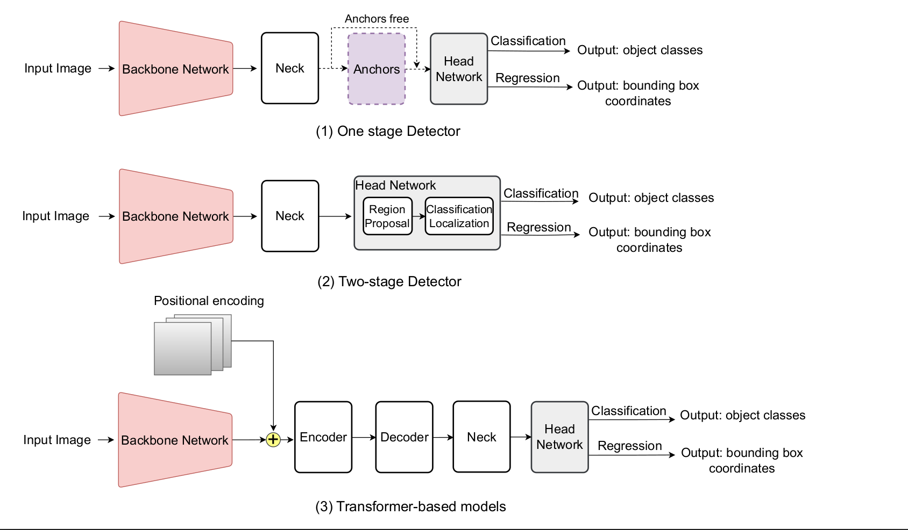

# 📊 Optimizing Object Detection Models for TinyML: A Comprehensive Survey

## Overview

This GitHub repository is developed to reference all the models in our survey, allowing you to easily access the respective research papers and their corresponding code (if available). The tables below summarize recent advancements in **lightweight object detection models** and provide direct links to their sources.

The models in this repository are categorized based on:
1. **The part of the architecture they optimize** – whether it is the **backbone, neck, or head** of the object detection pipeline.
2. **The type of optimization applied**, such as **quantization, pruning, knowledge distillation, or neural architecture search (NAS)**.

The following figures illustrate:
- The structure of different object detection architectures.
- The categorization of optimization methods used in model design.

<div align="center">

|  |  |
|:----------------------------------------------------------:|:-------------------------------------------------:|
| *Object Detection Architecture Components* | *Categorization of Optimization Techniques* |

</div>


---

## 📌 Table 1: Summary of recent lightweight OD models and their performance on COCO and PASCAL VOC datasets. 

| <div align="center"><b>Optim.</b></div> | **Model**                                       | **Year** | **Optim. parts**       | **Params (M)** | **AP50:95 (COCO)** | **mAP (Pascal VOC)** | **GitHub Code** |
|------------------------------------------|------------------------------------------------|---------|-----------------------|---------------|-------------------|--------------------|---------------|
| <div align="center"><b>Model Design</b></div> | [MobileNetV1 + SSDLite](https://arxiv.org/abs/1801.04381)                     | 2018    | backbone              | 5.1           | 22.2              | 68.0               |  [🔗](https://github.com/qfgaohao/pytorch-ssd)        |
|                                          | [MobileNetV2 + SSDLite](https://arxiv.org/abs/1801.04381)                     | 2018    | backbone              | 4.3           | 22.1              | 70.9               | [🔗](https://github.com/qfgaohao/pytorch-ssd)              |
|                                          | [Tiny-DSOD](https://arxiv.org/abs/1807.11013)                                 | 2018    | backbone, neck        | 1.15          | 23.2              | 72.1               |  [🔗](https://github.com/lyxok1/Tiny-DSOD)            |
|                                          | [LightDet](https://ieeexplore.ieee.org/document/9054101)                                  | 2020    | backbone, neck, head  | -         | 24.0             | 75.5                  | ❌             |
|                                          | [GnetDet](https://arxiv.org/abs/2103.15756)                                   | 2021    | backbone, head        | -             | -                 | 66.0               | ❌             |
|                                          | [YOLOv5-N](https://doi.org/10.5281/zenodo.7347926)                                  | 2022    | backbone, neck, head  | 1.9           | 28.0              | -                  | [🔗](https://github.com/ultralytics/yolov5)        |
|                                          | [YOLOv5-S](https://doi.org/10.5281/zenodo.7347926)                                  | 2022    | backbone, neck, head  | 7.2           | 37.4              | -                  | [🔗](https://github.com/ultralytics/yolov5)        |
|                                          | [MobileDenseNet](https://arxiv.org/abs/2207.11031)                            | 2023    | backbone              | 5.8           | 24.8              | 76.8               | [🔗](https://github.com/hajizadeh/MobileDenseNet)          |
| <div align="center"><b>Pruning</b></div> | [Lite-YOLOv3](https://link.springer.com/article/10.1007/s11554-023-01379-4)                               | 2023    | backbone, neck, head  | 15.3          | 52.4              | 74.1               |  ❌           |
| <div align="center"><b>BNNs</b></div>    | [Faster-RCNN-Bi-Real Net](https://arxiv.org/abs/1808.00278)                   | 2018    | backbone              | 20.1          | -                 | 58.2               | [🔗](https://github.com/liuzechun/Bi-Real-net)          |
|                                          | [Unified network](https://doi.org/10.1049/trit.2018.1026)                           | 2018    | backbone              | -             | -                 | 44.3               | [🔗](https://github.com/bohanzhuang/Group-Net-image-classification)    |
|                                          | [ResNet-50 GroupNet-c](https://arxiv.org/abs/1909.09934)                      | 2019    | backbone              | -             | 33.9              | 74.4               | [🔗](https://github.com/bohanzhuang/Group-Net-image-classification)         |
|                                          | [ResNet-34 GroupNet-c](https://arxiv.org/abs/1909.09934)                      | 2019    | backbone              | -             | 32.8              | 69.3               | [🔗](https://github.com/bohanzhuang/Group-Net-image-classification)        |
|                                          | [ResNet-18 GroupNet-c](https://arxiv.org/abs/1909.09934)                      | 2019    | backbone              | -             | 30.1              | 63.6               | [🔗](https://github.com/bohanzhuang/Group-Net-image-classification)        |
|                                          | [Faster R-CNN-BiDet-Resnet18](https://arxiv.org/abs/2003.03961)               | 2020    | backbone, head        | 20            | 15.7              | 59.5               | [🔗](https://github.com/ZiweiWangTHU/BiDet)   |
|                                          | [Faster R-CNN-DA-BNN](https://www.sciencedirect.com/science/article/abs/pii/S0167865521004438)                       | 2020    | backbone, head        | -             | -                 | 64.0               | ❌             |
|                                          | [Faster-RCNN-XNOR-Net](https://www.sciencedirect.com/science/article/abs/pii/S0167865521004438)                      | 2022    | backbone, head        | 22.2          | -                 | 48.9               | ❌             |
| <div align="center"><b>NAS</b></div>     | [DetNASNet (FPN)](https://arxiv.org/abs/1903.10979)                            | 2019    | backbone              | -             | 36.6              | 81.5               | [🔗](https://github.com/megvii-model/DetNAS)        |
|                                          | [DetNASNet (RetinaNet)](https://arxiv.org/abs/1903.10979)                     | 2019    | backbone              | -             | 33.3              | 80.1               | [🔗](https://github.com/megvii-model/DetNAS)           |
|                                          | [NATS-C](https://arxiv.org/abs/1909.02293)                                    | 2019    | backbone              | -             | 38.4              | -                  | ❌             |
|                                          | [NAS-FCOS](https://arxiv.org/abs/1906.04423)                                  | 2019    | neck, head            | -             | 46.1              | -                  |  [🔗](https://github.com/Lausannen/NAS-FCOS)     |
|                                          | [NAS-FPNLite + MobileNetV2](https://arxiv.org/abs/1904.07392)                 | 2019    | neck                  | 2.16            | 24.2              | -                  | [🔗](https://github.com/open-mmlab/mmdetection)     |
|                                          | [MobileNetV2 + MnasFPN](https://arxiv.org/abs/1912.01106)                         | 2019    | head              | 1.29            | 23.8              | -                  | [🔗](https://github.com/tensorflow/models/tree/master/research/object_detection)          |
|                                          | [Hit-Detector](https://arxiv.org/abs/2003.11818)                              | 2020    | backbone, neck, head  | 27            | 41.4              | -                  | [🔗](https://github.com/ggjy/HitDet.pytorch)      |
|                                          | [YOLO-NAS-Small](https://zenodo.org/records/10944954)                            | 2021    | backbone, neck, head  | 19            | 47.5              | -                  | [🔗](https://github.com/ultralytics/ultralytics)        |
|                                          | [MCUNetV2](https://arxiv.org/abs/2110.15352)                                  | 2021    | backbone              | 0.67          | -                 | 68.3               | [🔗](https://github.com/mit-han-lab/mcunet?tab=readme-ov-file)     |
| <div align="center"><b>KD</b></div>      | [DarkNet-YOLO-BWN-KT](https://arxiv.org/abs/1804.06332)                        | 2018    | backbone              | -             | -                 | 65.0               | ❌             |
|                                          | [MOBILENET-Yolo-BWN-KT](https://arxiv.org/abs/1804.06332)                     | 2018    | backbone              | -             | -                 | 63.0               | ❌             |
|                                          | [Centernet-34](https://ieeexplore.ieee.org/document/9527668)                              | 2021    | backbone, head        | -             | -                 | 75.8               | ❌             |
|                                          | [Centernet-50](https://ieeexplore.ieee.org/document/9527668)                              | 2021    | backbone, head        | -             | -                 | 77.1               | ❌             |
| <div align="center"><b>Quantization</b></div> | [EtinyNet](https://ojs.aaai.org/index.php/AAAI/article/view/20387)                                   | 2022    | backbone              | 0.59          | -                 | 56.4               | ❌             |
|                                          | [TinyissimoYOLO](https://arxiv.org/abs/2307.05999)                            | 2023    | backbone, neck, head  | 0.703         | -                 | 56.4               | [🔗](https://github.com/ETH-PBL/TinyissimoYOLO)        |


## Table 2: Comparison of NAS-Based Object Detection Models on COCO Dataset

| **Method** | **Search** | **Optim. Parts** | **AP50:95** | **Search Cost** | **GitHub Code** |
|------------|-----------|-----------------|------------|---------------|---------------|
| [NAS-FCOS](https://arxiv.org/abs/1906.04423) | RL | Neck, Head | 43.0 | 28 GPU-days | [🔗](https://github.com/Lausannen/NAS-FCOS) |
| [MobileDets](https://arxiv.org/abs/2004.14525) | RL | Backbone | 28.5 | - | [🔗](https://github.com/tensorflow/models/tree/master/research/object_detection) |
| [NAS-FPN](https://arxiv.org/abs/1904.07392) | RL | Neck | 44.2 | 333 TPU-days | [🔗](https://github.com/DetectionTeamUCAS/NAS_FPN_Tensorflow) |
| [DetNAS](https://arxiv.org/abs/1903.10979) | EA | Backbone | 42.0 | 44 GPU-days | [🔗](https://github.com/megvii-model/DetNAS) |
| [EAutoDet-s](https://arxiv.org/abs/2203.10747) | Gradient | Backbone, Neck | 40.1 | 1.4 GPU-days | [🔗](https://github.com/vicFigure/EAutoDet?tab=readme-ov-file) |
| [EAutoDet-m](https://arxiv.org/abs/2203.10747) | Gradient | Backbone, Neck | 45.2 | 2.2 GPU-days | [🔗](https://github.com/vicFigure/EAutoDet?tab=readme-ov-file) |
| [EAutoDet-L](https://arxiv.org/abs/2203.10747) | Gradient | Backbone, Neck | 47.9 | 4.5 GPU-days | [🔗](https://github.com/vicFigure/EAutoDet?tab=readme-ov-file) |
| [EAutoDet-X](https://arxiv.org/abs/2203.10747) | Gradient | Backbone, Neck | 49.2 | 22.0 GPU-days | [🔗](https://github.com/vicFigure/EAutoDet?tab=readme-ov-file) |
| [ResNet-101 (NATS)](https://arxiv.org/abs/1909.02293) | Gradient | Backbone | 40.4 | 20.0 GPU-days | ❌ |
| [ResNeXt-101 (NATS)](https://arxiv.org/abs/1909.02293) | Gradient | Backbone | 41.6 | 20.0 GPU-days | ❌ |
| [FNA++ (RetinaNet)](https://arxiv.org/abs/2006.12986) | Gradient | Backbone | 34.7 | 8.5 GPU-days | [🔗](https://github.com/JaminFong/FNA) |
| [FNA++ (SSDLite)](https://arxiv.org/abs/2006.12986) | Gradient | Backbone | 23.9 | 21.0 GPU-days | [🔗](https://github.com/JaminFong/FNA) |
| [Hit-Detector](https://arxiv.org/abs/2003.11818) | Gradient | Backbone, Neck, Head | 41.4 | - | [🔗](https://github.com/ggjy/HitDet.pytorch) |
| [IC-ResNet50](https://arxiv.org/abs/2012.13587) | Gradient | Backbone, Neck, Head | 39.2 | - | [🔗](https://github.com/yifan123/IC-Conv) |

---

## Table 3: Comparative Analysis of MCU-Optimized Object Detection Models on VOC Benchmark

| **Model** | **Year** | **Optimization** | **Input Size** | **Parameters** | **MCU** | **MMACs** | **Peak SRAM (kB)** | **mAP** | **GitHub Code** |
|-----------|---------|-----------------|---------------|---------------|-----------|---------|---------------|------|---------------|
| [MCUNetV1-YOLOV2](https://arxiv.org/abs/2007.10319) | 2020 | NAS | 224×224 | 1.20M | STM32H743 | 168 | 466 | 51.4% | [🔗](https://github.com/mit-han-lab/mcunet) |
| [MCUNetV2-YOLOV3-M4](https://arxiv.org/abs/2110.15352) | 2021 | NAS | 224×224 | 0.47M | STM32F412 | 172 | 247 | 64.6% | [🔗](https://github.com/mit-han-lab/tinyengine) |
| [MCUNetV2-YOLOV3-H7](https://arxiv.org/abs/2110.15352) | 2021 | NAS | 224×224 | 0.67M | STM32H743 | 343 | 438 | 68.3% | [🔗](https://github.com/mit-han-lab/tinyengine) |
| [EtinyNet-SSD](https://ojs.aaai.org/index.php/AAAI/article/view/20387) | 2022 | Quantization (ASQ) | 256×256 | 0.59M | STM32H743 | 164 | 395 | 56.4% | ❌ |
| [TinyissimoYOLO](https://arxiv.org/abs/2307.05999) | 2023 | Quantization (QAT) | 112×112 | 0.703M | GAP9 | 55 | - | 56.4% | [🔗](https://github.com/ETH-PBL/TinyissimoYOLO) |
| [XiNet-YOLOV7-S](https://ieeexplore.ieee.org/document/10377703) | 2023 | Model Design (HAS) | 256×256 | - | STM32H743 | 80 | 53 | 54% | ❌ |
| [XiNet-YOLOV7-M](https://ieeexplore.ieee.org/document/10377703) | 2023 | Model Design (HAS) | 384×384 | - | STM32H743 | 220 | 138 | 67% | ❌ |
| [XiNet-YOLOV7-L](https://ieeexplore.ieee.org/document/10377703) | 2023 | Model Design (HAS) | 416×416 | - | STM32H743 | 789 | 511 | 74.9%| ❌ |

---

**Notes:**
- **Peak SRAM**: Indicates the maximum on-chip **SRAM** usage during inference, measured in kilobytes (kB).

---


### 📖 How to Use This Repository

- Click the **🔗 links** to access the **paper** or **GitHub repository** for each model.

---

### 📢 Citation
If you find this useful, please consider citing our **survey paper** (Coming soon).

```bibtex
@article{your_survey,
  author  = {Your Name and Co-Authors},
  title   = {Survey on Lightweight Object Detection Models},
  journal = {IEEE Transactions on Emerging Topics in Computational Intelligence},
  year    = {2024}
}

